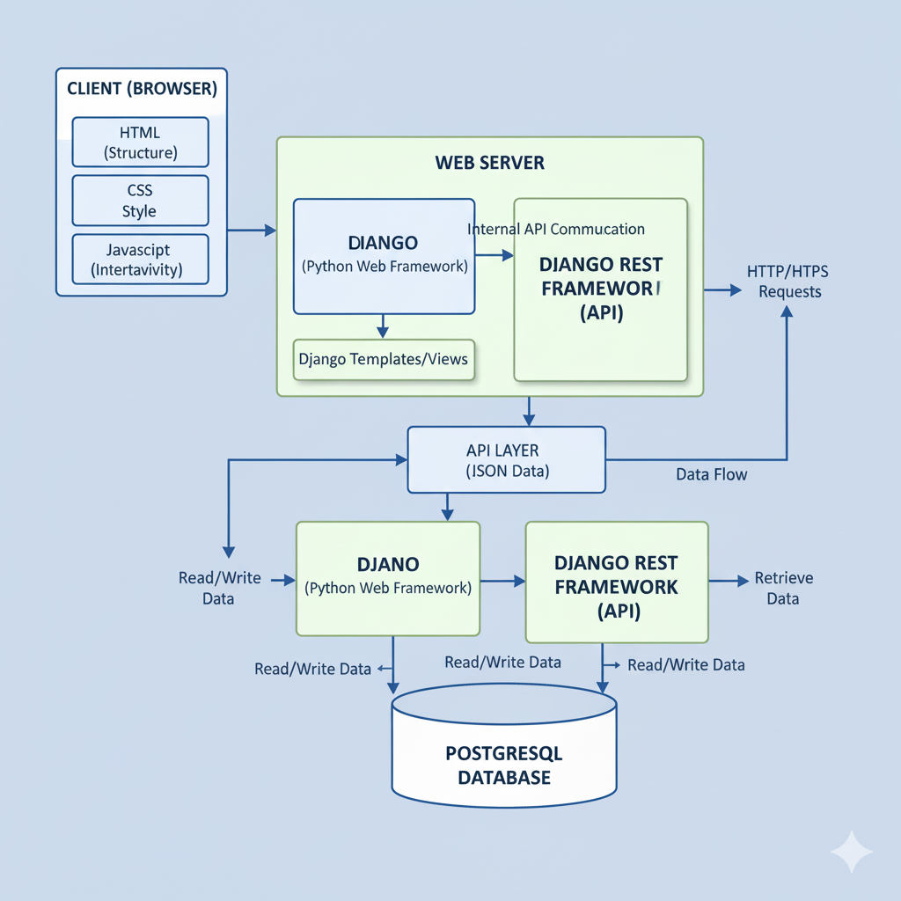

# 🧠 Hackathon Website

A fullstack web application built using **Django**, **Django REST Framework**, and **PostgreSQL**, designed for hackathon-style rapid prototyping and scalable development.  
It combines a RESTful backend API with a dynamic HTML/CSS/JS frontend.

---

## 📖 Table of Contents

- [About](#about)
- [Architecture Overview](#architecture-overview)
- [Tech Stack](#tech-stack)
- [Features](#features)
- [Project Structure](#project-structure)
- [Contact](#contact)
- [Getting Started](#getting-started)
  - [Prerequisites](#prerequisites)
  - [Installation](#installation)
  - [Running Locally](#running-locally)
- [Contributing](#contributing)
- [License](#license)
- [Contact](#contact)

---

## 🧾 About

This project serves as a **hackathon boilerplate** demonstrating a modular fullstack architecture:

- **Django** handles the backend logic, ORM, and authentication.
- **Django REST Framework (DRF)** provides API endpoints for data exchange.
- **Frontend (HTML/CSS/JS)** interacts with the API to deliver an interactive user interface.

---

## 🏗️ Architecture Overview

Below is the high-level architecture of this project:



**Flow Summary:**

1. **Client (Browser)** — HTML, CSS, and JavaScript handle structure, styling, and interactivity.
2. **Web Server** — Django processes requests, renders templates, and communicates with DRF internally.
3. **API Layer** — Django REST Framework exposes endpoints returning JSON responses.
4. **Database** — PostgreSQL stores and retrieves persistent data.
5. **Data Flow** — Client ⇄ Django ⇄ DRF ⇄ PostgreSQL.

---

## 🧩 Tech Stack

| Layer | Technology | Description |
|-------|-------------|-------------|
| **Frontend (Client)** | **HTML5**, **CSS3**, **JavaScript (Vanilla JS)** | Handles UI structure, styling, and interactivity. Communicates with backend via HTTP/HTTPS requests. |
| **Backend (Web Server)** | **Django (Python Web Framework)** | Manages server-side logic, routing, and serves templates or APIs. |
| **API Layer** | **Django REST Framework (DRF)** | Exposes RESTful API endpoints for frontend communication. Serializes data between Django models and JSON. |
| **Database** | **PostgreSQL** | Stores and retrieves persistent application data. |
| **Communication** | **HTTP / HTTPS**, **JSON** | Enables client–server communication. |
| **Runtime / Language** | **Python 3.x**, **JavaScript (ES6)** | Primary languages for backend and frontend. |


Chatting system |
Client → Daphne (ASGI) → Django Channels → Redis → Multiple Consumers


---

## ✨ Features

- **Elderly Health Monitoring** — Daily check-ins and vital tracking dashboard.  
- **AI Health Assistant** — 24/7 intelligent chatbot support for medical queries.  
-  **Secure Patient Portal** — Simple login system with personal health records.  
-  **Real-Time Updates** — Patient status and alerts for caregivers.  
-  **Modular Design** — Django + DRF + PostgreSQL for scalability.  
-  **Analytics Ready** — Extendable for data visualization and predictive insights.
- **Shared Experiences** - Learn from others facing similar challenges
-**Group Channels**: Multiple themed discussion rooms


---

## 🗂️ Project Structure

```text
hackathon-website/
├── backend/                                # Main Django Backend Root
│   ├── backend/                            # Project Settings Directory
│   │   ├── settings.py                     # Main configuration (DB, INSTALLED_APPS, CHANNELS)
│   │   ├── urls.py                         # Root URL router (HTTP)
│   │   ├── routing.py                      # Root ROUTING router (WebSocket/ASGI)
│   │   └── wsgi.py / asgi.py               # Server interface files
│   ├── api/                                # Example Django API Application
│   │   ├── models.py                       # Database schemas
│   │   ├── views.py                        # HTTP endpoint logic (DRF Views)
│   │   ├── serializers.py                  # DRF data serialization
│   │   ├── urls.py                         # App-specific HTTP URLs
│   │   └── consumers.py                    # WebSocket handling logic
│   ├── manage.py                           # Django command-line utility
│   └── requirements.txt                    # Python dependencies (Django, DRF, Channels, Redis)
├── frontend/                               # Static Frontend Files
│   ├── index.html                          # Main application structure
│   ├── style.css                           # Styling and presentation
│   └── script.js                           # Client-side logic and API/WebSocket calls
├── assets/                                 # Static assets (images, fonts, etc.)
├── architecture.png                        # System architecture diagram
├── .gitignore
└── README.md


---

## ⚙️ Getting Started

### Prerequisites
- Python 3.8+
- pip
- PostgreSQL
- Node.js (optional for frontend tools)
- Git

### Installation

```bash
git clone https://github.com/ashpb07/hackathon-website.git
cd hackathon-website


cd backend
python -m venv venv
source venv/bin/activate        # macOS/Linux
# venv\Scripts\activate         # Windows
pip install -r requirements.txt
python manage.py migrate


cd ../frontend
# Modify index.html, style.css, or script.js as needed


cd backend
python manage.py runserver


| Name     | Role               | Contact                                                                                        |
| -------  | ------------------ | ---------------------------------------------------------------------------------------------- |
| Shreya   | Frontend Developer | [Email](mailto:shreyashridhar19@gmail.com) / [GitHub](https://github.com/shreyashridhara)      |
| Pranjal  | Frontend Developer | [Email](mailto:pranjalshetty18@gmail.com) / [GitHub](https://github.com/PranjalShetty)         |
| Anish    | Backend Developer  | [Email](mailto:anishprabhu783@gmail.com) / [GitHub](https://github.com/ashpb07)                |
| Hithansh | Designer           | [Email](mailto:hithansharekere@gmail.com) / [GitHub](https://github.com/hithansharekere-debug) |
