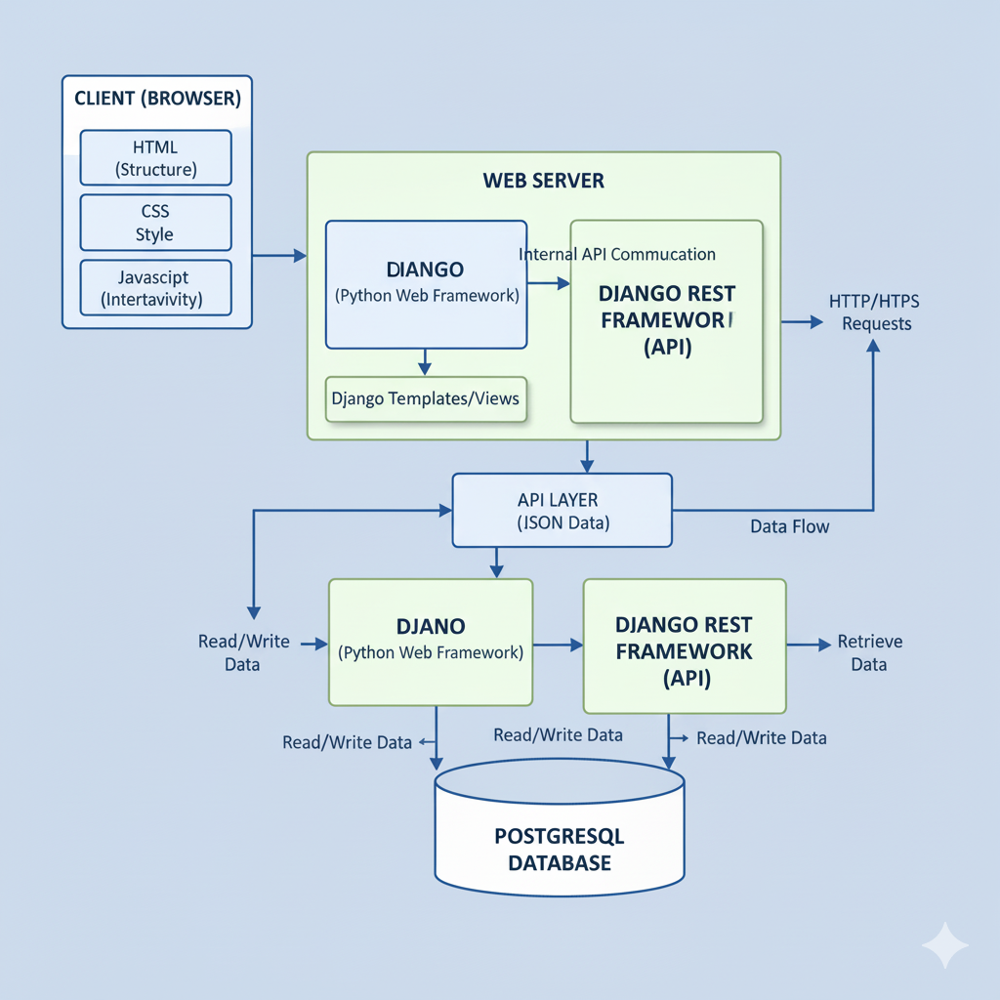
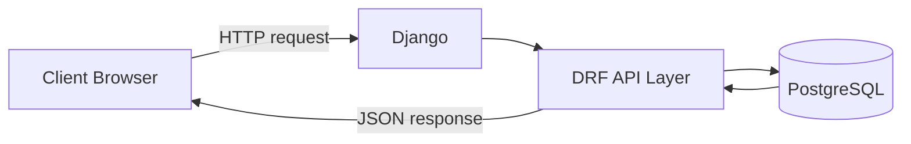
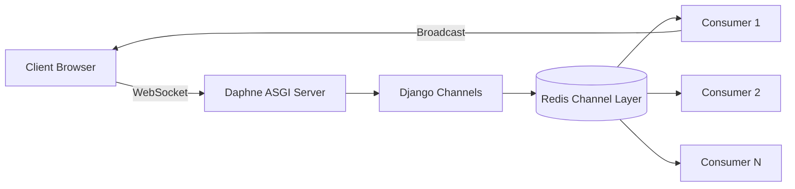

# Healthsync

A fullstack web application built with Django, Django REST Framework, and PostgreSQL, designed for hackathon-style rapid prototyping with a path to scalable production use. It combines a RESTful backend API, real-time WebSocket features, and a dynamic HTML/CSS/JS frontend.

## Table of Contents

- [About](#about)
- [Architecture Overview](#architecture-overview)
- [Tech Stack](#tech-stack)
- [Features](#features)
- [Project Structure](#project-structure)
- [Getting Started](#getting-started)
  - [Prerequisites](#prerequisites)
  - [Installation](#installation)
  - [Running Locally](#running-locally)
- [Contributors](#contributors)
- [License](#license)

## About

This project is a hackathon boilerplate demonstrating a modular fullstack architecture:

- **Django** handles backend logic, the ORM, and authentication.
- **Django REST Framework (DRF)** exposes API endpoints for data exchange.
- **Django Channels + Redis** power real-time features such as chat and live status updates.
- **Frontend (HTML/CSS/JS)** consumes the API and WebSocket connections to deliver an interactive interface.

## Architecture Overview



### Request/Response Flow (HTTP)


```mermaid
flowchart LR
    A[Client Browser] -->|HTTP request| B[Django]
    B --> C[DRF API Layer]
    C --> D[(PostgreSQL)]
    D --> C
    C -->|JSON response| A
```

### Real-Time Flow (WebSocket)


```mermaid
flowchart LR
    A[Client Browser] -->|WebSocket| B[Daphne ASGI Server]
    B --> C[Django Channels]
    C --> D[(Redis Channel Layer)]
    D --> E[Consumer 1]
    D --> F[Consumer 2]
    D --> G[Consumer N]
    E -->|Broadcast| A
```

**Flow summary:**

1. **Client (Browser)** — HTML, CSS, and JavaScript handle structure, styling, and interactivity.
2. **Web Server** — Django processes HTTP requests and routes them internally.
3. **API Layer** — DRF exposes RESTful endpoints and serializes data to/from JSON.
4. **Real-Time Layer** — Django Channels, running on Daphne (ASGI), uses Redis as a channel layer to broadcast events across multiple WebSocket consumers.
5. **Database** — PostgreSQL stores and retrieves persistent application data.

## Tech Stack

| Layer | Technology | Description |
|-------|-----------|-------------|
| Frontend | HTML5, CSS3, JavaScript (Vanilla) | UI structure, styling, and interactivity. Communicates with the backend over HTTP and WebSocket. |
| Backend | Django | Server-side logic, routing, and templates. |
| API Layer | Django REST Framework | RESTful endpoints; serializes data between Django models and JSON. |
| Real-Time | Django Channels, Daphne, Redis | WebSocket support for chat and live updates. |
| Database | PostgreSQL | Persistent application data. |
| Communication | HTTP/HTTPS, WebSocket, JSON | Client-server communication. |
| Language/Runtime | Python 3.x, JavaScript (ES6) | Primary backend and frontend languages. |

## Features

- **Elderly Health Monitoring** — daily check-ins and a vitals tracking dashboard.
- **AI Health Assistant** — chatbot support for medical queries.
- **Secure Patient Portal** — login system with personal health records.
- **Real-Time Updates** — live patient status and alerts for caregivers.
- **Shared Experiences** — space to learn from others facing similar challenges.
- **Group Channels** — multiple themed discussion rooms.
- **Modular Design** — Django, DRF, and PostgreSQL for scalability.
- **Analytics Ready** — extendable for data visualization and predictive insights.

## Project Structure

```text
hackathon-website/
├── backend/
│   ├── backend/
│   │   ├── settings.py       # Configuration (DB, INSTALLED_APPS, CHANNELS)
│   │   ├── urls.py           # Root URL router (HTTP)
│   │   ├── routing.py        # Root routing (WebSocket/ASGI)
│   │   └── wsgi.py / asgi.py # Server interface files
│   ├── api/
│   │   ├── models.py         # Database schemas
│   │   ├── views.py          # HTTP endpoint logic (DRF views)
│   │   ├── serializers.py    # DRF data serialization
│   │   ├── urls.py           # App-specific HTTP URLs
│   │   └── consumers.py      # WebSocket handling logic
│   ├── manage.py
│   └── requirements.txt      # Django, DRF, Channels, Redis, etc.
├── frontend/
│   ├── index.html
│   ├── style.css
│   └── script.js
├── assets/                   # Images, diagrams, fonts
├── .gitignore
└── README.md
```

## Getting Started

### Prerequisites

- Python 3.8+
- pip
- PostgreSQL
- Redis (for Channels)
- Node.js (optional, for frontend tooling)
- Git

### Installation

```bash
git clone https://github.com/ashpb07/hackathon-website.git
cd hackathon-website

cd backend
python -m venv venv
source venv/bin/activate        # macOS/Linux
# venv\Scripts\activate         # Windows

pip install -r requirements.txt
python manage.py migrate
```

### Running Locally

```bash
# Start Redis (required for Channels/WebSocket features)
redis-server

# Start the Django backend
cd backend
python manage.py runserver
```

Open `frontend/index.html` in a browser, or serve it with any static file server. Edit `index.html`, `style.css`, or `script.js` as needed.

## Contributors

| Name | Role | Contact |
|------|------|---------|
| Shreya | Frontend Developer | [Email](mailto:shreyashridhar19@gmail.com) · [GitHub](https://github.com/shreyashridhara) |
| Pranjal | Frontend Developer | [Email](mailto:pranjalshetty18@gmail.com) · [GitHub](https://github.com/PranjalShetty) |
| Anish | Backend Developer | [Email](mailto:anishprabhu783@gmail.com) · [GitHub](https://github.com/ashpb07) |
| Hithansh | Designer | [Email](mailto:hithansharekere@gmail.com) · [GitHub](https://github.com/hithansharekere-debug) |

## License

MIT
